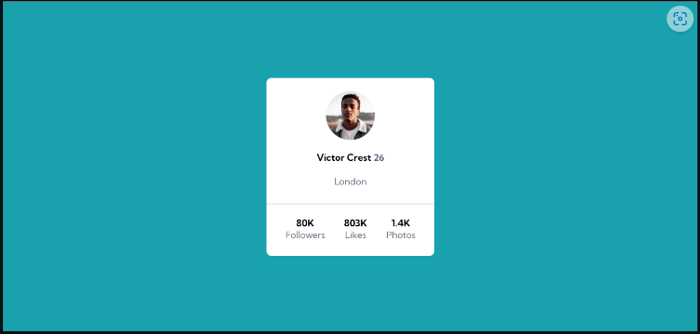
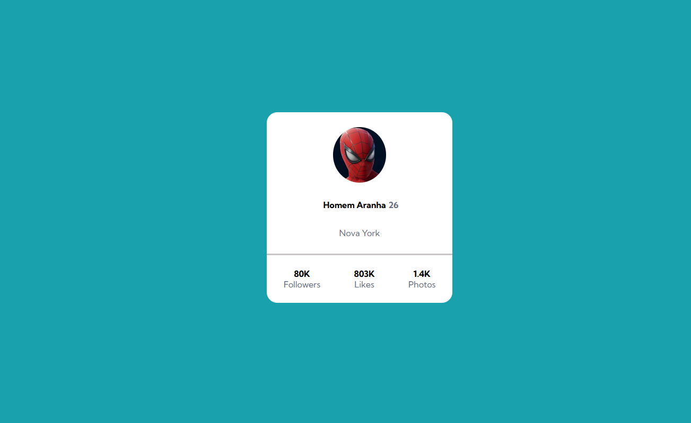
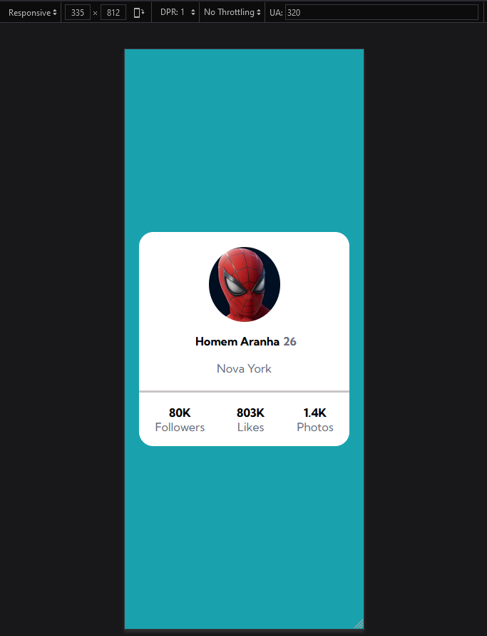

# Exercício de Flexbox utilizando um Cartão de Perfil (Profile Card)

Um projeto para testar o conhecimento de Git Bash, HTML e  CSS, principalmente Flexbox 🔥

Descrição da tarefa: O principal desafio é criar um cartão que contenha as informações de perfil. Para aprimorar as habilidades de posicionamento de elementos usando flexbox.

A vantagem do Flexbox é a adaptabilidade. Independente do tamanho da tela do usuário, os elementos serão mostrados de maneira correta.

## Informações do Design a ser seguido

### Font family para ser usada no projeto:

- Family: [Kumbh Sans](https://fonts.google.com/specimen/Kumbh+Sans)
- Weights: 400, 700

### Cores
***
--background-color: hsl(185, 75%, 39%);  
--text-color: hsl(227, 10%, 46%);
***

### Imagens do Design a ser seguido

  

## Imagens do Design criado

<!--  -->

## Tecnologias utilizadas
- HTML
- CSS
- Git Bash

### Como utilizar

1 - Clone o projeto
***
git clone <https://github.com/cezarviana/exercicio-profile-card.git>
***

2 - Acessar a pasta do projeto
***
cd exercicio-profile-card
***
