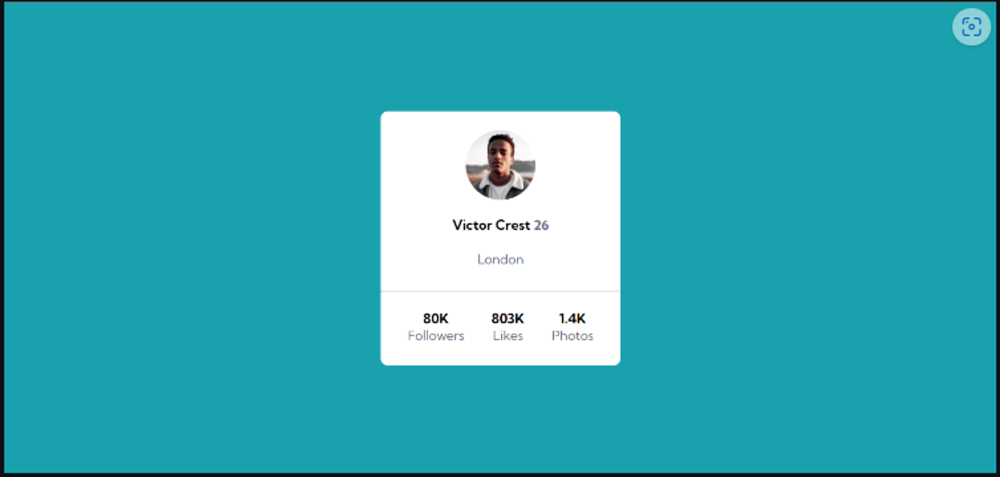
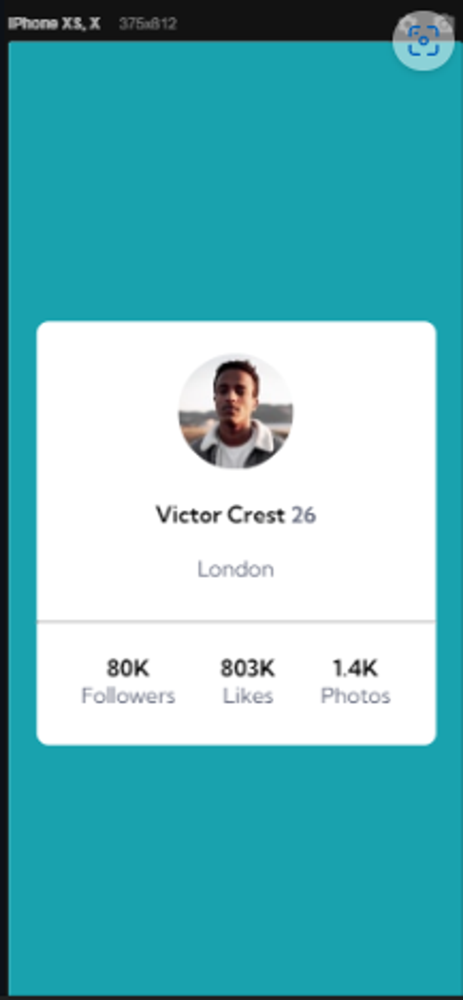
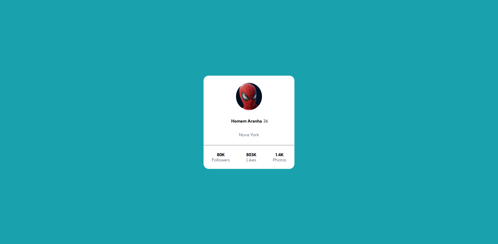
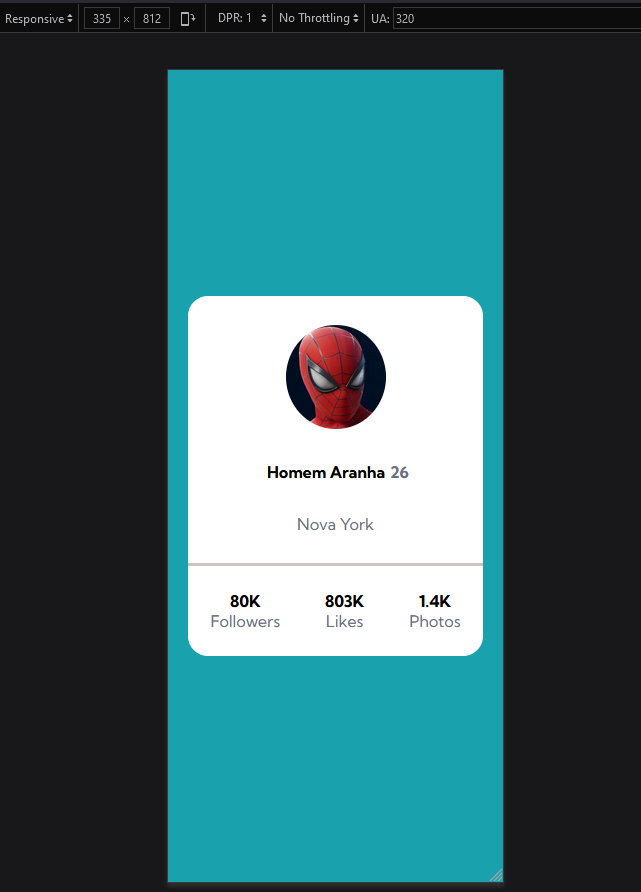

# ⚡ Exercício de Flexbox utilizando um Cartão de Perfil (Profile Card)

## 📝 Descrição do Projeto
Um projeto que apresenta um Cartão de Perfil (Profile Card), com elementos apresentando Seguidores (Followers), Gostei (Likes) e Fotos (Photos) para testar o conhecimento de Git, HTML e  CSS, principalmente Flexbox. A vantagem do Flexbox é a adaptabilidade. Independente do tamanho da tela do usuário, os elementos serão mostrados de maneira correta.

O principal desafio é criar um cartão que contenha as informações de perfil. Para aprimorar as habilidades de posicionamento de elementos usando flexbox.

Link do projeto: [Cartão de Perfil](https://cezarviana.github.io/exercicio-profile-card/)


## 🔎 Funcionalidades
- Responsivo para todos os dispositivos
- Construção do HTML e CSS


## 🛠️ Ferramentas utilizadas
- **HTML:** Estruturação do projeto
- **CSS:** Estilização do projeto, responsivo
- **Git:** Ferramenta de versionamento


## 🎨 Imagens do projeto

### Imagens do Design a ser seguido
<div align="center">
 <br>

</div>

### Imagens do Design criado
<div align="center">


</div>


## 💡 Decisões do projeto
1. **Fontes**
- [Kumbh Sans](https://fonts.google.com/specimen/Kumbh+Sans)

2. **Cores**
```
--background-color: hsl(185, 75%, 39%);
--text-color: hsl(227, 10%, 46%);
```


## 💦 Dificuldades do projeto
- Separar os elementos de Seguidores (Followers), Gostei (Likes) e Fotos (Photos), de maneira que fiquem como no Design original.


## 🔓 O que eu aprendi
- Com alguns testes, consegui colocar os elementos em uma disposição similar ao do Design original. Isso permitiu aprimorar meu entendimento no uso do `display: flex;`


## 💭 Possíveis atualizações futuras
- Finalizar o README ✅

## 🚀 Como rodar o projeto
Siga os passos abaixo para executar o projeto na sua máquina:

### Pré requisitos

- <strong><i>Git</i></strong>: Para clonar o repositório.


1. Abra o git, e execute os seguintes comandos
2. **Clonar o repositório:**
   ```bash
   git clone https://github.com/cezarviana/exercicio-profile-card.git
   ```
3. npm install
4. npm run dev
5. **Abrir o arquivo index.html:** Abra o arquivo `index.html` em um navegador web.